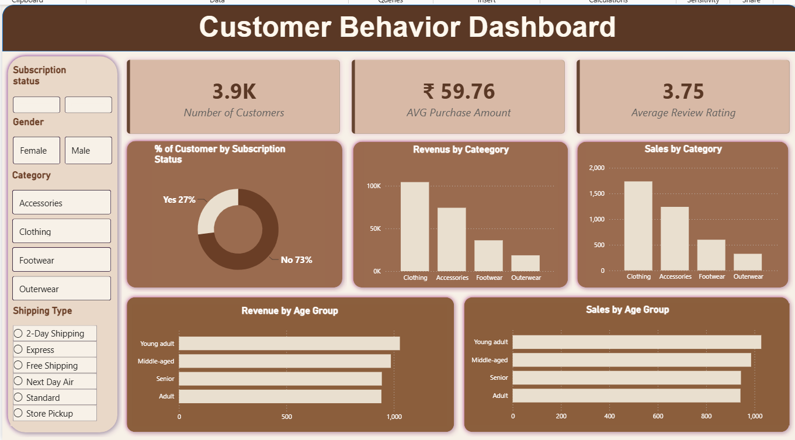

# 🛍️ Customer Shopping Behaviour Analysis

An end-to-end Data Analytics project analyzing customer shopping behavior using **Python, Pandas, SQL, MySQL, and Power BI**.

The project focuses on understanding customer purchasing patterns, revenue contribution, product performance, discounts, subscriptions, and customer segmentation.

---

## 📌 Project Overview

The goal of this project is to transform raw customer shopping data into meaningful business insights.

The project follows an end-to-end analytics workflow:

**Raw Data → Data Cleaning → Exploratory Data Analysis → SQL Analysis → Power BI Dashboard → Business Insights**

---

## 🛠️ Tools & Technologies

- 🐍 **Python**
- 🐼 **Pandas**
- 🗄️ **MySQL**
- 📊 **SQL**
- 📈 **Power BI**
- 📓 **Jupyter Notebook**

---

## 📂 Project Structure

```text
Customer-Behaviour-Analysis/
│
├── README.md
├── Customer Behaviour Analysis.ipynb
├── Customer Behaviour Analysis.sql
├── Customer Behavior Dashboard.pbix
├── customer_shopping_behavior.csv
├── CBD.png
├── CBD.mp4
└── Customer-Shopping-Behavior-Analysis.pptx

🧹 Data Cleaning & Preparation
Python and Pandas were used to clean and prepare the dataset.

Key tasks included:
Checking for missing/null values
Handling missing review ratings
Creating customer age groups
Converting purchase frequency into numerical days
Checking duplicate/redundant columns
Transforming categorical data
Preparing the cleaned dataset for SQL analysis

Age Group Segmentation
Customers were divided into four age groups:
Young Adult
Adult
Middle-aged
Senior

Purchase Frequency
Purchase frequencies were converted into numerical values:
Weekly → 7 days
Fortnightly → 14 days
Monthly → 30 days
Quarterly → 90 days
Annually → 365 days

🗄️ SQL Analysis
The cleaned data was loaded into MySQL and analyzed using SQL queries.
Some of the business questions explored were:
What is the total revenue generated by male vs. female customers?
Which customers used a discount but still spent more than the average purchase amount?
What are the top 5 products with the highest average review rating?
How does average purchase amount differ by shipping type?
Do subscribed customers spend more?
Which products have the highest percentage of discounted purchases?
How can customers be segmented based on previous purchases?
What are the top 3 most purchased products within each category?
Are repeat buyers more likely to subscribe?
What is the revenue contribution of each age group?

📊 Power BI Dashboard
An interactive Customer Behaviour Dashboard was created using Power BI.

Dashboard Features
👥 Total Customer KPI
💰 Revenue analysis
🛒 Sales analysis
⭐ Customer rating analysis
👤 Gender analysis
📦 Category analysis
🎯 Subscription analysis
🚚 Shipping type analysis
👶 Age group analysis
🔎 Interactive slicers

Dashboard Preview


🔍 Key Analysis Areas
Customer Analysis
Customer demographics
Gender distribution
Age group segmentation
Previous purchase behavior
Product Analysis
Most purchased products
Product ratings
Category-wise performance
Revenue Analysis
Revenue by category
Revenue by age group
Average purchase amount
Total revenue
Subscription Analysis
Subscribers vs. non-subscribers
Spending behavior
Repeat buyers and subscription behavior
Discount Analysis
Discount usage
Discount percentage by product
Spending behavior after discounts

💡 Skills Demonstrated
Data Cleaning
Data Preprocessing
Exploratory Data Analysis
Pandas
SQL Queries
Aggregations
GROUP BY
CASE statements
Subqueries
Window Functions
Customer Segmentation
Data Visualization
Power BI
Dashboard Design
Business Insight Generation

🔄 Project Workflow
Customer Shopping Dataset
          ↓
     Python + Pandas
          ↓
    Data Cleaning
          ↓
   Exploratory Analysis
          ↓
       MySQL
          ↓
     SQL Analysis
          ↓
      Power BI
          ↓
 Interactive Dashboard
          ↓
   Business Insights
🎯 Project Objective
The main objective of this project was to practice an end-to-end data analytics workflow and understand how raw customer data can be transformed into actionable business insights.

👩‍💻 Author
Khushi Sonawane
Aspiring Data Analyst | Python | SQL | Power BI | Pandas

⭐ If you found this project useful
Feel free to explore the project, provide feedback, or connect with me on LinkedIn!
